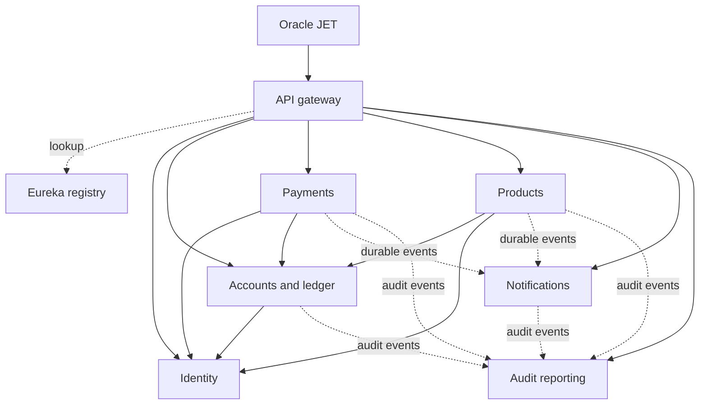

# Service architecture

## Request path



Each application has its own jar, port, configuration, repositories and migrations. Eureka resolves HTTP addresses. One Oracle PDB hosts six private schemas without cross-schema grants, joins, foreign keys, synonyms, or shared business entities. Cross-service identifiers are logical references verified through the owning service when accepting commands.

A monorepo keeps contracts and changes reviewable together. It does not require deploying every application together. The shared runtime is a versioned build dependency; changing it requires rebuilding affected consumers, but it has no shared runtime process or database.

## Public route ownership

All browser endpoints start with `/api/v1` on the gateway.

| Prefix | Destination |
|---|---|
| `/auth`, `/profile` | identity-service |
| `/accounts` (including history and statements) | accounts-ledger-service |
| `/beneficiaries`, `/billers`, `/transfers`, `/bill-payments` | payments-service |
| `/cards`, `/loans` | products-service |
| `/notifications` | notification-service |
| `/admin` | audit-reporting-service |

The gateway uses a strict route allowlist, rejects traversal and encoded path separators, strips caller-supplied internal credentials, does not follow redirects, and caps request/response bodies at 1 MiB/16 MiB. It forwards bearer authentication; each destination independently verifies access tokens and enforces ownership or roles. Statement exports larger than the response cap require a narrower date range.

## Identity and internal authentication

Identity signs RS256 access tokens with a private RSA key. Other applications receive only its public key. Issuer, audience, signature and token purpose distinguish access tokens from short-lived TOTP login challenges. Existing HMAC tokens are invalid after this migration; users must sign in again.

Internal calls use a unique outgoing token and `X-Service-Name`. Receivers store SHA-256 hashes of caller tokens and compare them in constant time. Possessing another caller's configured hash does not let a service impersonate that caller. Method authorization restricts which callers may invoke customer lookup, OTP grants, or ledger posting. Internal tokens are never browser credentials. For deployment across machines, TLS and network isolation are required; the development setup uses loopback HTTP.

Access tokens expire after fifteen minutes by default. Immediate global token revocation is not implemented; account locking prevents new logins but existing access tokens may remain valid until expiry. A production deployment needs a revocation/session policy, key rotation, rate limiting and an actual OTP delivery adapter.

## Internal command contracts

| Endpoint | Owner | Allowed callers |
|---|---|---|
| `GET /internal/customers/by-user/{userId}` | identity | accounts-ledger, payments, products |
| `POST /internal/otp/challenges` | identity | payments |
| `POST /internal/otp/authorizations` | identity | payments |
| `GET /internal/accounts/{accountId}/owners/{userId}` | accounts-ledger | payments, products |
| `POST /internal/ledger/operations` | accounts-ledger | payments, products |
| `POST /internal/events` | notifications / audit-reporting | Authorized event producers |

Ledger request example (trusted internal HTTP only):

```json
{
  "operationId": "a-stable-uuid",
  "userId": 7,
  "sourceAccountId": 10,
  "destinationAccountNumber": "123456789012",
  "destinationIfsc": "ABCD0001234",
  "type": "TRANSFER",
  "amount": 100.0000,
  "currencyCode": "INR",
  "narration": "Rent"
}
```

The receipt contains `transactionId`, `reference`, `status`, `amount`, and `currencyCode`. Repeating the same caller/operation ID returns the original receipt. Changed immutable fields return `409`. Payments may issue `TRANSFER` and simulated bill `WITHDRAWAL`; products may issue `LOAN_PAYMENT`. No customer can call this endpoint directly.

## Financial consistency

### Transfers and bill payments

1. Payments checks ownership, beneficiary/biller eligibility, limits and immutable intent.
2. It persists a workflow in `AWAITING_OTP`, bound to the customer request key and fingerprint. Immutable payment details are stored without OTP plaintext.
3. Identity consumes the OTP and stores an authorization grant atomically. A retry for the same operation and intent can recover that grant; a different operation cannot reuse it.
4. Payments commits `AUTHORIZED` before sending the ledger command.
5. Accounts-ledger locks account rows in ID order. In one local transaction it writes the deduplication receipt, balance changes, transaction entries/history and audit outbox event. Internal transfers debit and credit together.
6. Payments saves the receipt, marks `COMPLETED`, and queues audit/notification events in its own transaction.

These are separate database transactions. A crash after ledger commit leaves a recoverable workflow, not a distributed rollback. The recovery worker calls the ledger with the same operation ID and completes the original workflow without another debit. Definite validation/ownership rejections mark `FAILED`; ambiguous network/server failures remain recoverable. Clients must retain their original idempotency key after a timeout.

Transfers are limited to accounts in this bank. An unknown external destination or mismatched IFSC is rejected before debit. Bill payment is a local simulation and does not perform live biller settlement.

### Loan repayments

Products locks the loan and reserves the requested principal in a durable `RESERVED` workflow. The sum of pending reservations cannot exceed outstanding principal. After ledger success, products applies the principal reduction, writes repayment history, marks `COMPLETED` and queues events atomically. Retries recover the same ledger receipt. A definitive ledger rejection marks `FAILED` and releases the reservation. Ambiguous failures keep it reserved for recovery.

Recovery workers run every fifteen seconds, in batches of fifty; deferred retries wait thirty seconds so older failures do not indefinitely starve later operations. Do not manually clear reservations or change operation IDs after an uncertain debit. Investigate the ledger receipt first.

## Durable events

Each service has an `event_outbox`; receivers have an `event_inbox`. Events carry a UUID, source, type and JSON payload. Producers insert events inside the local transaction. A worker sends them through authenticated discovery HTTP every five seconds, retries with bounded backoff, and marks delivery only after acknowledgment. Receivers commit the inbox record and business effect together, so duplicate delivery has one effect.

This gives durable, at-least-once delivery without requiring a local message broker. It does not guarantee event order or immediate notification/audit visibility. Monitor pending outbox rows and workflow age. There is no automatic retention/dead-letter policy yet; failed records are retained for investigation. Never put passwords, tokens or OTP values in event payloads.

## Deployment limits

The service boundaries and recovery mechanisms are implemented, but production readiness requires additional operational work: TLS certificates, secret rotation, least-privilege runtime accounts, centralized metrics/traces, alerting on unresolved workflows/outboxes, backups and restoration drills, delivery providers, and a reconciled data cutover. The one-instance discovery policy intentionally excludes horizontal scaling and high availability.

Existing business features are preserved; unfinished administrator user/account monitoring, profile provisioning, external payment settlement and frontend screens are not supplied by splitting the runtime. The audit service currently exposes audit search. Live Oracle validation is a required local release check, not covered by H2 tests.
